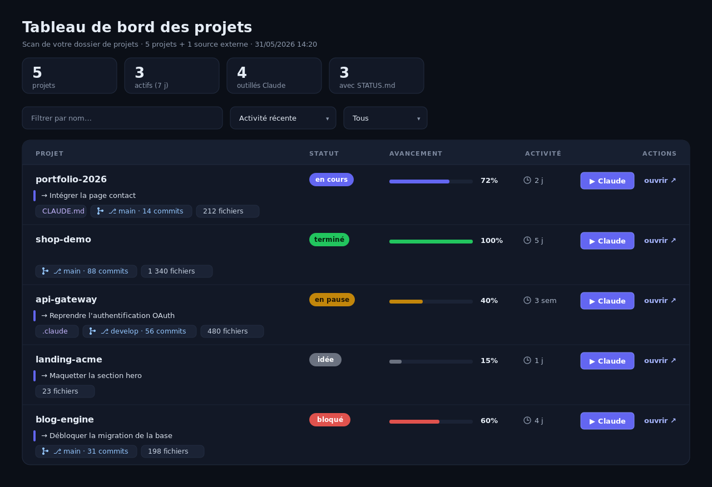

# Dashboard d'avancement des projets

[English](README.md) · **Français**

> **Open source — licence [MIT](LICENSE).** PHP pur, zéro dépendance, une seule page.

Un tableau de bord **PHP pur, zéro dépendance** qui scanne un dossier de projets web
locaux et affiche, pour chacun, son activité (git + dernière modif) et un avancement
« métier » lu dans un fichier `STATUS.md` optionnel à la racine de chaque projet.

Pensé pour un poste de dev local (Laragon, XAMPP, MAMP, `php -S`…) où l'on jongle entre
beaucoup de sites et où l'on veut une vue d'ensemble : *où en est quoi, qu'est-ce qui
bouge, quelle est la prochaine étape*.

<!-- Ajoutez votre capture d'écran, p.ex. :  -->

---

## Fonctionnalités

- **Scan automatique** d'un dossier : chaque sous-dossier = un projet.
- **Activité déduite** sans config : branche git, nombre de commits, fichiers non
  commités, dernière activité (commit ou mtime des fichiers).
- **Avancement « métier »** lu depuis un `STATUS.md` par projet (statut, %, prochaine
  étape) ; à défaut, statut présumé d'après l'activité récente.
- **Projets multi-chantiers** : tableau `## Chantiers` agrégé (moyenne des %, statut déduit).
- **Vue tableau** : colonnes Projet · Statut · Avancement · Activité · Actions, en-tête
  collant (sticky), filtre/tri côté client.
- **Racines externes** : afficher (en lecture seule) des dossiers hors de la racine web,
  sans jamais les exposer en HTTP.
- **Bouton « Claude » optionnel** (Windows + WSL clé en main ; Linux/macOS adaptable) :
  rouvre un projet dans un terminal local. **Désactivé par défaut** — voir [Sécurité](#sécurité).

---

## Prérequis

- **PHP 8.0+** (testé sur 8.3). Aucune extension particulière, aucune dépendance Composer.
- Un **serveur web local** servant le dossier, au choix :
  - **Laragon** / **XAMPP** / **WAMP** / **MAMP** (Apache + PHP),
  - ou le serveur intégré PHP : `php -S localhost:8000` depuis la racine.
- Le **cœur (scan + affichage) est multiplateforme** (Windows / Linux / macOS).
  Le **bouton « Claude »** est livré clé en main pour **Windows + WSL**, et adaptable
  à Linux/macOS (voir la section dédiée — non testé par l'auteur).

---

## Installation (rapide)

1. **Copiez** ce dossier dans votre racine web, à côté de vos projets :

   ```
   .../www/
   ├── projets/        ← ce dashboard
   ├── mon-site-a/
   ├── mon-site-b/
   └── ...
   ```

2. **Créez votre config** à partir du modèle :

   ```bash
   cd projets
   cp config.example.php config.php
   ```

3. **Ouvrez-le** dans le navigateur : `http://localhost/projets/`
   (ou votre vhost, ex. `http://projets.test`, ou `php -S localhost:8000` puis
   `http://localhost:8000`).

C'est tout. Par défaut il scanne le dossier **parent** et liste vos projets.

---

## Configuration

Tout se règle dans **`config.php`** (copié depuis `config.example.php`, ignoré par git
pour que chaque poste ait le sien). Clés :

| clé | rôle |
|---|---|
| `root` | Dossier scanné (chaque sous-dossier = un projet). Défaut : le dossier parent. |
| `extra_roots` | Dossiers **externes** à afficher en plus (lus côté serveur, jamais servis en HTTP). `[]` = aucun. |
| `exclude` | Sous-dossiers de `root` à ignorer. |
| `exclude_prefix` | Tout dossier commençant par ce préfixe est ignoré (`_` par défaut). |
| `enable_launch` | Active le bouton « Claude » (**exec local — voir Sécurité**). `false` par défaut. |
| `launch.wsl_distro` | Nom de la distro WSL (`wsl -l -q`). |
| `launch.command` | Commande lancée dans le dossier du projet. |
| `scan_file_cap` | Plafond de fichiers scannés/projet pour estimer l'activité (perf). |
| `skip_dirs` | Dossiers jamais traversés pendant ce scan (lourds). |

---

## La convention `STATUS.md`

Pour qu'un projet affiche un avancement réel, placez un `STATUS.md` à **sa** racine
(pas dans le dashboard). Sans lui, le dashboard se rabat sur l'activité git/mtime.
Modèle complet dans [`STATUS.md.example`](STATUS.md.example). Format :

```markdown
---
status: en cours        # idée | en cours | en pause | bloqué | terminé | abandonné
progress: 60            # 0 à 100
next: <prochaine étape concrète>
updated: 2026-05-31
---

# Notes libres (ignorées par le dashboard)
```

Projet sur plusieurs fronts ? Laissez `status`/`progress` vides et ajoutez un tableau
`## Chantiers` (le dashboard agrège moyenne des `progress` + statut déduit) :

```markdown
## Chantiers

| chantier     | statut   | progress | next                      |
|--------------|----------|----------|---------------------------|
| Front public | en cours | 80       | Finaliser page tarifs     |
| API          | en pause | 40       | Reprendre après le front  |
```

---

## Le bouton « Claude » (optionnel — Windows + WSL clé en main)

Sur chaque ligne, un bouton peut **rouvrir le projet dans un terminal local** (par
défaut : `claude --continue || claude` dans le dossier du projet — adaptez `launch.command`
à n'importe quel outil : `code .`, `git status`, votre éditeur…).

C'est **désactivé par défaut**. Pour l'activer (poste local uniquement) :

1. `enable_launch => true` dans `config.php`.
2. Renseignez `launch.wsl_distro` (`wsl -l -q`) et `launch.command`.
3. Rechargez. Lisez d'abord la section [Sécurité](#sécurité).

### Sur Linux / macOS — *faisable, non testé par l'auteur*

Le **cœur** du dashboard tourne partout. Seul ce bouton est livré clé en main pour
**Windows + WSL** (il convertit le chemin `C:\…` → `/mnt/…` et passe par
`launch-claude.bat`). Le principe — exécuter une commande dans un terminal, après un
`cd` dans le dossier du projet — est transposable, mais demande d'**éditer le handler
`launch` dans `index.php`** (retirer la conversion de chemin Windows : sur Unix le chemin
est déjà natif) et de remplacer l'appel au `.bat` par :

- **Linux** (X11/Wayland) — un émulateur de terminal, p.ex. :
  `gnome-terminal --working-directory="$DIR" -- bash -lic "$CMD"`
  (ou `konsole --workdir`, `xterm -e`, `x-terminal-emulator`).
- **macOS** — via AppleScript, p.ex. :
  `osascript -e 'tell app "Terminal" to do script "cd \"$DIR\" && $CMD"'`
  (ou iTerm).

⚠️ **Contrainte commune** (équivalent de la *window-station* sous Windows) : pour ouvrir
une fenêtre, **PHP doit tourner dans la session graphique de l'utilisateur** — donc lancé
via `php -S localhost:8000` depuis *votre* terminal, **pas** sous un Apache/nginx système
(un daemon n'a pas accès à l'affichage : `DISPLAY`/X sous Linux, TCC sous macOS).

*Ces pistes Linux/macOS ne sont pas testées par l'auteur — à valider sur votre poste.*

---

## Sécurité

⚠️ **Le bouton « Claude » exécute une commande système** (`exec()` côté PHP). Quand
`enable_launch = true`, le dashboard expose un endpoint qui lance un processus sur la
machine qui sert PHP. Protections en place :

- **Désactivé par défaut** (`enable_launch = false`) : un déploiement vierge n'exécute rien.
- **POST + jeton CSRF de session** : un site tiers ne peut pas déclencher l'action.
- **Loopback only** : l'endpoint refuse toute requête dont l'IP n'est pas `127.0.0.1`/`::1`.
- **Liste blanche** : seul un nom de projet réellement scanné est accepté ; le chemin est
  dérivé côté serveur, jamais construit depuis l'entrée utilisateur.

**À respecter si vous l'activez :**

- **Poste local mono-utilisateur uniquement.** Ne servez **jamais** ce dashboard sur
  `0.0.0.0`, un réseau, un host partagé ou public avec `enable_launch = true` : ce serait
  une **exécution de commande à distance**.
- Ne retirez pas le contrôle loopback / CSRF.
- `extra_roots` est lu côté serveur mais **n'est pas** servi en HTTP — ne placez pas le
  dashboard *dans* un dossier contenant des secrets en pensant qu'ils sont protégés ;
  c'est le docroot du serveur qui décide ce qui est accessible.

---

## Adapter / étendre

- **Changer ce qui est scanné** → `root`, `exclude`, `exclude_prefix`, `extra_roots`.
- **Changer ce que fait le bouton** → `launch.command` (n'importe quelle commande).
- **Changer l'apparence** → tout le CSS est inline dans `index.php` (variables de couleur
  dans `:root`, ~ligne 350). Une seule page, pas de build.
- **Ajouter une colonne / un filtre** → la collecte est dans la boucle `foreach ($projects…)`,
  le rendu juste en dessous, le filtre/tri dans le `<script>` final.

---

## Structure

```
projets/
├── index.php            # toute l'app : scan + rendu + endpoint launch (PHP + HTML + CSS + JS)
├── config.example.php   # modèle de config (commité)
├── config.php           # votre config locale (gitignoré)
├── launch-claude.bat    # lanceur Windows/WSL du bouton "Claude" (optionnel)
├── STATUS.md.example    # modèle de STATUS.md pour vos projets
├── README.md            # version anglaise
├── README.fr.md         # ce fichier
├── TUTO.md              # tutoriel pas-à-pas (anglais)
└── TUTO.fr.md           # tutoriel pas-à-pas (français)
```

## Licence

**Open source sous licence [MIT](LICENSE)** © 2026 Jean-Benoît Kauffmann (orilyt.com). Usage, modification et
redistribution libres (y compris commercial) ; conservez la mention de copyright.
Aucune dépendance tierce.
